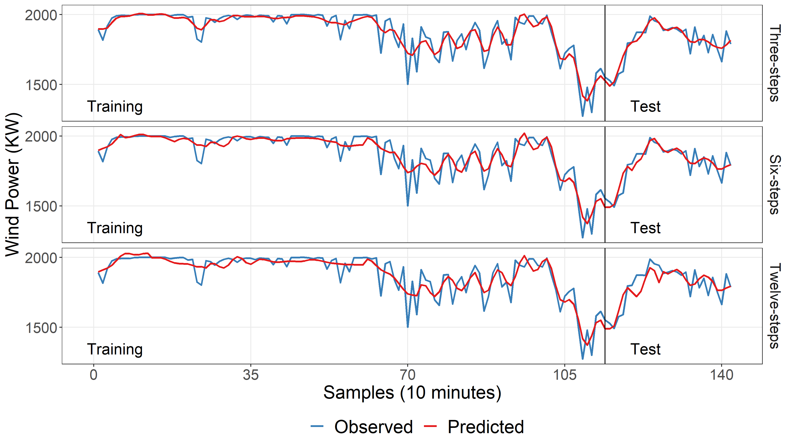

# Publication in [18th Brazilian Congress of Thermal Sciences and Engineering (2020 ENCIT)](https://eventos.abcm.org.br/encit2020/)

## :zap: Wind energy multi-step ahead forecasting based on variational mode decomposition
| **Wind energy forecasting for August 26th 2017** |
|:----:|
||


### Publication
- [Conference paper (ABCM proceedings)]()

### How to cite this paper
```bibtex

```
